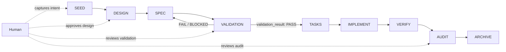
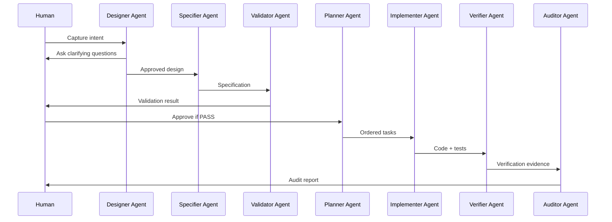

# sdd-framework


**Agent-first Spec-Driven Development for human-governed AI engineering.**

> No spec = no implementation.

`sdd-framework` is a contract-based SDD framework for human–AI collaborative engineering. Humans capture intent and approve checkpoints. AI agents execute the development pipeline through explicit roles, artifacts, and validation gates.

---

## At a glance

| Area | Description |
|---|---|
| Core rule | No implementation without a validated spec |
| Default executor | AI agents |
| Governance model | Human approval at explicit gates |
| Pipeline | SEED → DESIGN → SPEC → VALIDATION → TASKS → IMPLEMENT → VERIFY → AUDIT → ARCHIVE |
| Main artifact | Feature record with phase state, ownership, and validation result |
| Best for | Human–AI collaborative software engineering |

---

## Why this exists

Most SDD, BDD, and RFC-style workflows are human-first: humans write the specification, humans validate it, and humans decide when implementation is safe.

`sdd-framework` is agent-first:

1. A human captures a seed: an intent, bug, idea, or requested change.
2. AI agents advance that seed through a governed pipeline.
3. Humans approve explicit checkpoints.
4. Implementation is blocked until the spec has passed validation.

The framework provides contracts, prompts, artifact formats, and gates so agents stay scoped, auditable, and aligned with the approved specification.

---

## Pipeline



> Hard rule: implementation is blocked unless the active feature record contains `validation_result: PASS`.

---

## Core idea

A feature starts as a lightweight human seed and becomes an auditable implementation through bounded agent roles.



The human remains the governing authority. Agents are bounded executors.

---

## What you get

- **Role contracts** for designer, specifier, validator, planner, implementer, verifier, and auditor agents.
- **Validation gates** that block implementation until the spec is complete, deterministic, and implementable.
- **Traceable artifacts** for every phase of the feature lifecycle.
- **Handoff rules** that prevent role mixing and hidden state.
- **Prompt contracts** designed for agentic execution rather than manual ceremony.

---

## Who is this for?

| Role | How you use it |
|---|---|
| Solo developer | Use AI agents as disciplined pair programmers that cannot skip specs or drift into implementation. |
| Tech lead | Enforce validated specs before code reaches implementation. |
| Product manager | Capture seeds, triage ideas, and feed a governed engineering pipeline. |
| AI engineer | Provide autonomous agents with explicit roles, contracts, and validation gates. |
| Domain expert | Describe what you need; agents produce specs and implementation artifacts for human approval. |

---

## Canonical phases

| Phase | Owner | Purpose |
|---|---|---|
| SEED | Human | Capture intent, bug, idea, or requested change. |
| DESIGN | Designer Agent | Define goals, constraints, non-goals, and expected outcome. |
| SPEC | Specifier Agent | Define expected behavior, interfaces, errors, acceptance criteria, and scenario-driven tests (SDT). |
| VALIDATION | Validator Agent | Gate the spec for completeness, determinism, and implementability. |
| TASKS | Planner Agent | Break the validated spec into minimal ordered tasks. |
| IMPLEMENT | Implementer Agent | Execute tasks and write tests where applicable. |
| VERIFY | Verifier Agent | Run tests and SDT scenarios. Report PASS/FAIL with evidence. |
| AUDIT | Auditor Agent | Review spec-code alignment, risks, quality, and traceability. |
| ARCHIVE | Human | Close the feature and preserve artifacts. |

---

## Quick start

### 1. Clone the framework

```bash
git clone https://github.com/magronxo/sdd-framework.git
cd sdd-framework
```

### 2. Copy the framework into your project

```bash
cp -r 00_core 01_execution 02_policies 03_operations 04_project_governance templates docs sdd.config.json AGENTS.md /your/project/
```

### 3. Initialize artifact directories

```bash
./init-sdd.sh
```

On Windows:

```powershell
.\init-sdd.ps1
```

### 4. Configure your project

Edit:

```text
sdd.config.json
```

Set your project paths, stack, test conventions, artifact directories, and skill registry path.

### 5. Capture a seed

Create a seed from the seed template:

```text
03_operations/pre_sdd/seeds/YYYY-MM-DD_idea_name.md
```

A seed can describe:

- a feature idea
- a bug
- a refactor
- an integration need
- a migration
- an operational change

### 6. Start the agent workflow

Point your AI agent to:

```text
AGENTS.md
00_core/SDD_RUNTIME.md
00_core/SDD_HANDOFF_CONTRACT.md
00_core/SDD_READING_CONTRACT.md
sdd.config.json
```

The agent should read the seed, ask clarifying questions, create or update the active feature record, and advance through the pipeline according to its assigned role.

---

## Agent entrypoint

If you are an AI agent reading this repository:

1. Read `AGENTS.md`.
2. Read `00_core/SDD_RUNTIME.md`.
3. Read `00_core/SDD_HANDOFF_CONTRACT.md`.
4. Read `00_core/SDD_READING_CONTRACT.md`.
5. Read `sdd.config.json`.
6. Read the active feature record from `artifacts/features_for_specs/`.
7. Operate only in your assigned role.
8. Stop if ambiguity exists. Report it. Do not guess.

---

## Project structure

| Path | Purpose |
|---|---|
| `00_core/` | Runtime contracts, handoff rules, feature format, reading order. |
| `01_execution/prompts/` | Agent role prompts for designer, specifier, validator, planner, implementer, verifier, and auditor. |
| `01_execution/skills/` | Reusable agent skills. Empty by default; add your own. |
| `02_policies/` | Governance rules, report envelopes, validation boundaries, and integration surfaces. |
| `03_operations/` | Operational workflows, pre-SDD intake, re-audit flow, and audit strategy. |
| `04_project_governance/` | Project identity, glossary, manifest, and project map. |
| `templates/` | Templates for design docs, specs, ADRs, migration plans, and related artifacts. |
| `docs/` | Human-facing guides and project documentation. |
| `artifacts/` | Generated work: feature records, designs, specs, tasks, reports, and audits. |
| `sdd.config.json` | Project configuration: paths, stack, surfaces, migration settings, and registry paths. |
| `AGENTS.md` | Main agent entrypoint and execution contract. |

---

## Key principles

| Principle | Meaning |
|---|---|
| Agent-first | The default executor is an AI agent, not a human. |
| Human-governed | Humans capture intent, approve gates, and review outcomes. |
| Specs are authority | Behavior must be backed by a validated spec. |
| No role mixing | Designer ≠ Specifier ≠ Implementer. Agents stay in lane. |
| Validation gate | `validation_result: PASS` is required before implementation. |
| Evidence-first | Verification and audit require execution evidence, not assumptions. |
| Minimal context | Agents use the smallest context needed for the current phase. |
| Deterministic handoffs | Each phase produces explicit artifacts; no hidden state. |

---

## Comparison

| Framework | Human effort | Agent effort | Governance model | Best for |
|---|---:|---:|---|---|
| BDD / Cucumber | High | Low | Team-defined | Human teams with strong test discipline |
| MetaGPT / CrewAI | Low | High | Agent-driven | Rapid prototyping and autonomous workflows |
| Rust RFC / PEP | High | None | Committee / maintainer-governed | Language and platform evolution |
| `sdd-framework` | Medium | High | Contract-based, human-approved | Human–AI collaborative engineering |

---

## Example usage

See `examples/agenticos/` for a production-style example of this framework in use.

It demonstrates:

- completed feature artifact chains
- historical evolution of the framework
- all major pipeline phases
- pre-SDD intake and triage batches
- validation, verification, and audit reports

---

## Customization

### Adapting prompts

The prompts in `01_execution/prompts/` are agent role contracts. Customize them for:

- your programming language
- your framework
- your test conventions
- your review process
- your organizational constraints

Keep the core structure, phase boundaries, and handoff rules intact.

### Adding skills

Skills are reusable agent capabilities.

Create:

```text
01_execution/skills/<skill-name>.md
```

A skill should define:

- type
- trigger
- inputs
- outputs
- scope
- failure mode

Register the skill in the configured skill registry path from `sdd.config.json`.

See:

```text
01_execution/skills/README.md
```

---

## Non-goals

`sdd-framework` is not:

- a general-purpose agent framework
- a replacement for human engineering judgment
- a project management tool
- a guarantee that LLM output is correct
- a fully autonomous software factory

It is a governance and execution framework for keeping AI-assisted development scoped, validated, and auditable.

---

## Contributing

This is an early framework. Feedback is valuable, especially around:

- validation reports from real projects
- prompt adaptations for different stacks
- friction points encountered by agents
- new skills or role contracts
- use cases outside software engineering

See `CONTRIBUTING.md` for details.

---

## Status

Current version: `0.1.0-beta`

The framework is usable, but still early. Expect changes in:

- prompt contracts
- artifact schemas
- skill registration
- examples
- project initialization flow

---

## License

Licensed under the Apache License, Version 2.0.

See `LICENSE` for the full text.

Copyright © 2026 Oriol Coll.

