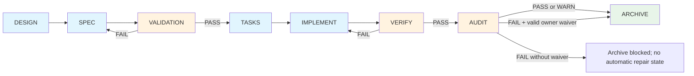
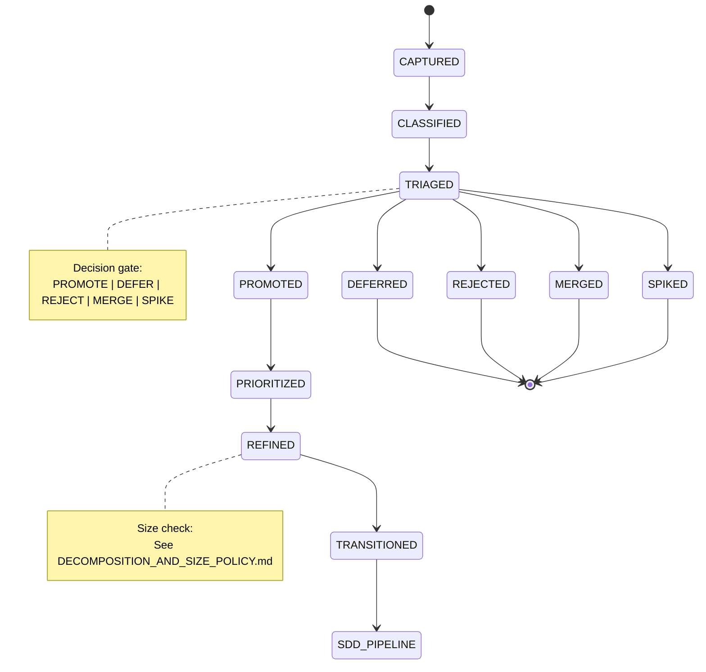
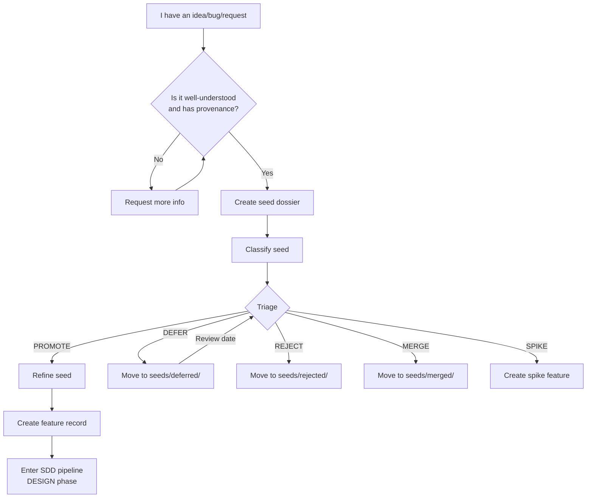
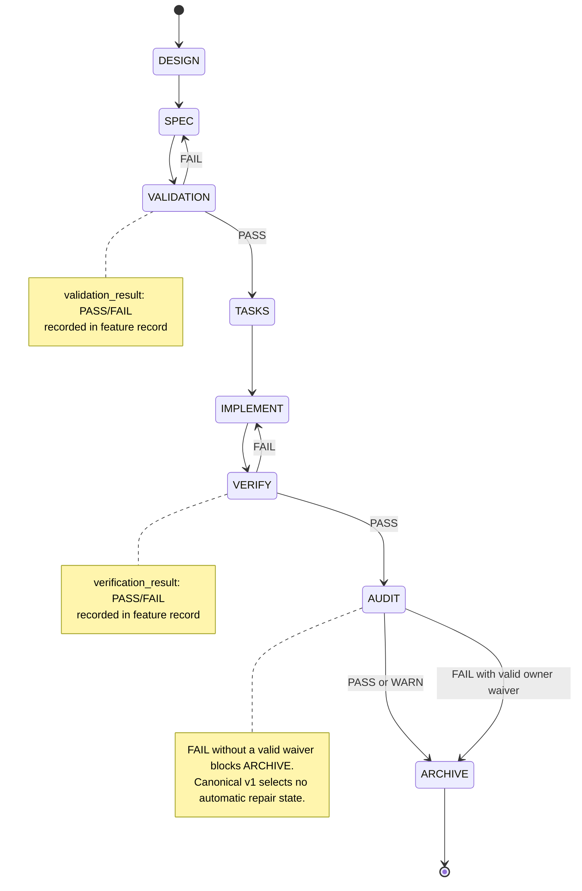
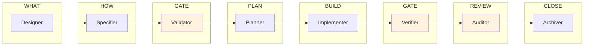

# SDD Pipeline Visual Overview

> **Mode Diátaxis**: Reference

## Purpose

Provide **diagrams** for the SDD pipeline, handoffs, and state machines.

Use these diagrams to:
- Understand the flow at a glance
- Onboard new team members
- Debug "where are we stuck?"

---

## Canonical Pipeline



**Legend**:
- 🟦 **Blue**: Production phase (creates artifacts or code)
- 🟨 **Orange**: Gate phase (decision: PASS/FAIL)
- 🟩 **Green**: Terminal phase

---

## Role Handoffs

```mermaid
sequenceDiagram
    participant D as Designer
    participant Sp as Specifier
    participant V as Validator
    participant P as Planner
    participant I as Implementer
    participant Ve as Verifier
    participant A as Auditor
    participant Ar as Archiver

    D->>Sp: Design doc
    Note over D,Sp: Gate: DESIGN complete?

    Sp->>V: Spec doc
    Note over Sp,V: Gate: SPEC complete?

    V->>P: validation_result: PASS
    Note over V,P: Gate: VALIDATION passed?
    V-->>Sp: validation_result: FAIL

    P->>I: Tasks doc
    Note over P,I: Gate: Tasks generated?

    I->>Ve: Code + tests
    Note over I,Ve: Gate: Implementation done?

    Ve->>A: verification_result: PASS
    Note over Ve,A: Gate: Tests pass?
    Ve-->>I: verification_result: FAIL

    A->>Ar: audit_result: PASS/WARN, or FAIL with valid owner waiver
    Note over A,Ar: AUDIT FAIL without a valid waiver blocks ARCHIVE; v1 selects no repair state

    Ar->>Ar: state: ARCHIVE
    Note over Ar: Feature closed
```

---

## Pre-SDD State Machine



---

## Where Does My Idea Go?



---

## Feature Record State Machine



---

## Role Boundaries



**Rules**:
- No role may produce artifacts owned by another role
- Gates (Validator, Verifier, Auditor) cannot modify artifacts they review
- The Archiver cannot rewrite specs retroactively

---

## Related Documents

- `docs/GETTING_STARTED.md` — step-by-step tutorial
- `docs/PROJECT_TOUR.md` — repository visual tour
- `00_core/SDD_RUNTIME.md` — execution contract
- `00_core/SDD_HANDOFF_CONTRACT.md` — handoff rules
- `03_operations/pre_sdd/PRE_SDD_RUNTIME.md` — Pre-SDD workflow
- `03_operations/WORKFLOW.md` — operational workflow
