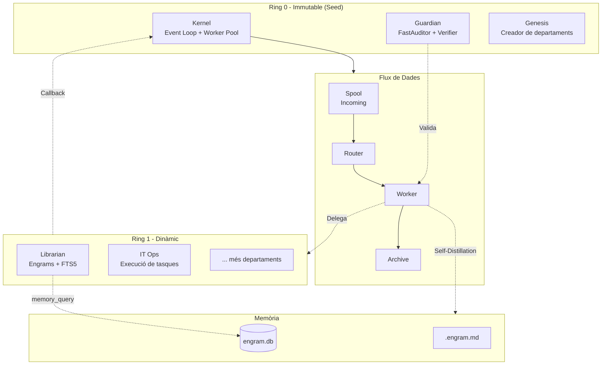

# 00. Manifest AgenticOS (Filosofia i Restriccions)

> **Actualitzat:** 2026-04-02 — Afegit Multi-Seed Architecture (14_MULTISEED_future.md), preparat per a homelab test (2 nodes).
> **Source of Truth:** Aquest document defineix les regles innegociables del sistema. Qualsevol decisió de disseny o implementació que violi aquest manifest ha de ser rebutjada.


## 1. Visió General
AgenticOS és un sistema operatiu d'agents d'IA local-first, basat en fitxers Markdown i amb una arquitectura de seguretat 'Zero Trust'. Actua com una "Llavor" autogenerativa.

- **Hardware Target:** Orange Pi 5B (16GB RAM) com a cervell central, delegant càlcul pesat a un PC Desktop (RTX 5050) via Ollama.
- **Stack Tecnològic:** Go (Kernel, Agents i API), React/ReactFlow (Dashboard web), WASM/MCP (Eines Sandboxed), Ollama (Inferència local), n8n (Automatització).

## 2. Els 8 Pilars Innegociables

### I. Zero Trust & "L'LLM no té mans"
Els agents estan aïllats en sandboxes. L'LLM només escup intencions (JSON). És el Kernel (síncron, programat en Go, robust i segur) qui valida l'acció contra la Constitució i l'executa físicament.

### II. Tot és un Fitxer
La comunicació és asíncrona i basada en el sistema d'arxius (`.ticket`, `.engram`). No hi ha APIs complexes entre agents, només esdeveniments de l'OS (Linux `inotify` / `watchdog`). Fixa't en el diagrama: és la representació visual perfecta de com **el sistema de fitxers i el cicle d'execució són exactament la mateixa cosa**. El tiquet viatja físicament pel disc a mesura que avança el seu estat.

### III. La Llavor Autogenerativa
No programem un OS sencer, programem un "Bootloader" i un Nucli de Seguretat. El sistema ha de poder mutar i crear nous agents, però amb mecanismes d'Anti-Suïcidi (Rollbacks) i ADN Immutable.

### IV. Filtre de Realitat Hardware
- **CPU:** El consum de CPU del Kernel en estat `IDLE` ha de ser proper al 0%.
- **RAM:** Minimitzar el context de l'LLM. Evitar "Mega-Prompts".
- **Xarxa:** Les operacions de xarxa (Ollama) poden fallar per timeout. El Kernel mai es pot bloquejar esperant una resposta.

### V. Observabilitat Radical (Glass Box Engineering)
Si no es pot testejar, loguejar i visualitzar, no s'implementa. L'arquitectura ha de ser transparent per a l'humà:
- **TDD Agèntic:** Qualsevol agent programador ha de demostrar el codi amb tests (ex: `go test`) abans de demanar aprovació.
- **Traçabilitat:** Cada acció, error o decisió (Engram) ha de tenir un Timestamp exacte i un UUID de tasca.
- **Visualització en Temps Real (Dashboard):** El Dashboard (React + ReactFlow) renderitzarà els fluxos agèntics en temps real amb nodes interactius (drag, zoom, pan). L'operador podrà veure com viatgen els tickets entre departaments, quins agents estan actius i com evoluciona el sistema.
- **Simplicitat de la Llavor:** La versió inicial (Bootloader) no dependrà de sistemes externs complexos (Prometheus, Grafana). S'utilitzaran eines lleugeres (SQLite, logs plans) que posteriorment podran ser consumides per l'ecosistema del Homelab (NocoDB, n8n, etc.).

### VI. El Ticket com a Unitat Fonamental (Màquina d'Estats)
El `.ticket.json` és l'únic contracte de comunicació vàlid. No hi ha APIs REST internes ni cues de missatges. El ticket és una **màquina d'estats** que viatja físicament pel disc:
- **11 Estats de Repòs:** `PENDING`, `PROCESSING`, `AUDITING`, `REQUIRES_HUMAN`, `WAITING`, `APPROVED`, `REJECTED`, `EXECUTING`, `LOOPING`, `COMPLETED`, `FAILED`.
- **Micro-estats (RAM):** Pensar, auditar, executar (no persistits per eficiència).
- **Atomicitat:** El Kernel mai edita un ticket "in-place". Sempre fa `os.Rename` per evitar corrupció.
- **Cicle de Vida:** 4 Fases (Ingestió → Assignació Atòmica → Bucle ReAct → Resolució).
- **Regla Anti-Bloat:** Si output > 2KB, es guarda en fitxer extern.

### VII. L'Engram com a Memòria Immutable (Self-Distillation)
Cada interacció resolta es destila en un **Engram** (`.engram.md`) immutables i indexables (SQLite FTS5). El sistema aprèn dels seus errors i èxits sense perdre informació:
- **Format:** Markdown amb **JSON frontmatter** (`---json ... ---`) i seccions estructurades. Prohibit YAML (ADR-005).
- **Indexació:** `topic_keys` permeten cerques semàntiques ràpides via SQLite FTS5.
- **Wal Mode:** Totes les `engram.db` operen en mode WAL per concurrència.
- **Arquitectura:** `engram.db` local per departament + índex global a `02_librarian`.
- **Auto-Compació:** Quan la carpeta d'engrames supera un llindar, el "Compactor" resumeix i arxiva.

### VIII. El Departament com a Agent (Analogia Corporativa)
Un agent **no és una classe de codi**, és una carpeta física al disc amb identitat, bústia i memòria. Els departaments es divideixen en anells de privilegi:
- **Ring 0 (Immutable):** `00_genesis` (creador) i `01_guardian` (seguretat). No poden ser alterats per altres agents.
- **Ring 1 (Dinàmic):** `10_it_ops` (operacions). Creats per treballar en tasques de l'usuari.

## 3. Immutabilitat de l'ADN (Hardware/OS Level)
- **Interfície:** Permisos del sistema operatiu amfitrió (Linux).
- **Lògica:** El Kernel s'executa sota un usuari sense privilegis (ex: `agenticos_user`). Els fitxers crítics (Constitució, Validador del Kernel, Esquemes DB) pertanyen a `root` amb permisos de només lectura (`chmod 444`).
- **Restriccions:** Cap agent, ni tan sols el Kernel mateix, pot modificar les Línies Vermelles del sistema. L'ADN és inalterable des de dins.

## 4. Arquitectura Multi-Seed Ready

### 4.1 Visió General

AgenticOS és **Multi-Seed Ready**: està preparat per escalar a múltiples nodes distribuïts sense canvis arquitecturals profunds.

```
┌─────────────────────────────────────────────────────────────┐
│                    MULTI-SEED ARCHITECTURE                   │
│                                                             │
│  ┌─────────────────┐      ┌─────────────────────────────┐  │
│  │  Control Plane   │      │  01_design/14_MULTISEED*.md │  │
│  │  (Master Seed)   │◄────►│  Full de ruta per expandir  │  │
│  └────────┬────────┘      └─────────────────────────────┘  │
│           │                                                  │
│  ┌────────┼────────┐                                        │
│  ▼        ▼        ▼                                        │
│ [Seed A] [Seed B] [Seed C]                                  │
│ (Local)  (PC)     (Remote/Enterprise)                       │
└─────────────────────────────────────────────────────────────┘
```

### 4.2 Estat Actual

| Component | Estat | Notes |
|-----------|-------|-------|
| **SEED-01** System prompts JSON | ✅ Implementat | Multi-seed: cada seed pot tenir prompts diferents |
| **SEED-02** Lazy agent load | ✅ Implementat | Multi-seed: agents carregats sota demanda |
| **SEED-03** Tool registry JSON | ✅ Implementat | Multi-seed: tools varien per seed |
| **Ticket system** | ✅ Implementat | Ja funciona com a RPC entre seeds |
| **Config externalitzada** | ✅ Implementat | Kernel rep config via paràmetre |

### 4.3 Timeline

1. **Ara:** Sistema single-seed estable → validar 1 use-case end-to-end
2. **Propera iteració:** Test homelab (2 nodes: OPI5B + PC)
3. **Futur:** Enterprise seeds amb clients

### 4.4 Conceptes Clau

| Terme | Definició |
|-------|-----------|
| **Seed** | Instància autònoma completa (Kernel + Agents + Memòria + Tools) |
| **Master Seed** | Control Plane que coordina (no executa) |
| **Worker Seed** | Execució de tasques |
| **Enterprise Seed** | Client remot amb UI simplificada |
| **Control Plane** | Registre de seeds, routing de tickets, observabilitat |

### 4.5 Quan NO fer Multi-Seed

- Core no estable
- Sense use-case validat
- Sense ticketing sòlid
- Sense dashboard usable

Veure document complet: `01_design/14_MULTISEED_future.md`

---

## 5. Arquitectura del Sistema (Visió Ràpida)

| Component | Tecnologia | Document de Referència | Funció |
|-----------|------------|------------------------|--------|
| **Kernel (El Nucli)** | Go (Pure Go) | `01_design/01_KERNEL.md` | Event Loop + Worker Pool + Semàfor + Circuit Breaker. Mou fitxers, valida accions, executa eines. |
| **Ticket (Unitat de Treball)** | JSON (`.ticket.json`) | `01_design/02_TICKET_SYSTEM.md` | Màquina d'estats que viatja pel disc. Conté metadades, steps (ReAct), mètriques i hash de deduplicació. |
| **Engram (Memòria)** | Markdown (JSON frontmatter) + SQLite FTS5 | `01_design/07_ENGRAM.md` | Memòria immutable i searchable amb scoring de rellevància. Anti-poisoning integrat. |
| **Departament (Agent)** | Carpeta física al disc | `01_design/03_FILESYSTEM_AND_DEPARTMENTS.md` | Conté `identity.md`, bústia (`inbox/`, `outbox/` sent mailbox) i memòria (`engram/`). |
| **Guardian (Seguretat)** | Go + LLM Verifier | `01_design/05_GUARDIAN.md` | Valida intencions. Fast-Path (polítiques JSON) vs Slow-Path (LLM). Generació automàtica de polítiques. |
| **Tools (Eines)** | WASM / MCP | `01_design/09_EXTENSIBILITY.md` | Aïllament perfecte (sandboxing). El Kernel executa binaris WASM o es connecta a MCP. |
| **Context Builder** | Go + Token Truncation | `01_design/08_CONTEXT_BUILDER.md` | Munta el prompt per a l'LLM: fitxers rellevants + engrames (amb scoring) + identitat. |
| **Frontend (Dashboard)** | React + ReactFlow | — | IDE Agentic amb visualització de fluxos en temps real. |
| **Inferència LLM** | Ollama (local) + LLM Proxy (cloud) | — | Models locals via Ollama; models cloud via proxy propi (Go, Zen, Gemini). |
| **Sistema de Fitxers** | Linux `inotify` / `fsnotify` | `01_design/03_FILESYSTEM_AND_DEPARTMENTS.md` | Comunicació asíncrona. Kernel dorm (0% CPU) i es desperta només quan hi ha nous fitxers. |
| **Observability** | React + ReactFlow + WebSocket | `01_design/10_OBSERVABILITY.md` | IDE Agentic, Dashboard/TUI, mètriques real-time. |
| **SDT / Holes Review** | — | `SDD/SDD_GUIDE.md` | Spec-Driven Development i SDT Framework. |

### Notes Importants
- **Seed (La Llavor):** Format pels departaments `00_genesis` + `01_guardian`. És immutable.
- **Ring 0:** Departaments fundacionals (`00_genesis`, `01_guardian`). No poden ser alterats.
- **Ring 1:** Departaments operacionals (`10_it_ops`, futurs). Creats per l'usuari o per `00_genesis` (amb aprovació).
- **Fast-Path:** Validació ràpida via polítiques JSON carregades a la memòria del Kernel.
- **Slow-Path:** Auditoria semàntica via LLM quan les polítiques ràpides no són suficients.

## 6. Guia de Navegació per Agents

### 6.1. Quick Reference: On Començar?

| Si ets... | Llegeix | Context Mínim | Document Clau |
|-----------|---------|---------------|---------------|
| **Agent nou** | Manifest + Glossari (02) | 20 min | 02_GLOSSARY.md |
| **Creador d'eines** | Extensibilitat (09) + Guardian (05) | 30 min | 09_EXTENSIBILITY.md |
| **Auditor/QA** | SDD Guide + Guardian (05) | 25 min | SDD/SDD_GUIDE.md |
| **DevOps** | Filesystem (03) + Observability (10) | 20 min | 03_FILESYSTEM_AND_DEPARTMENTS.md |
| **Arquitecte** | Tota la secció 01_design/ | 2h | 03_PROJECT_MAP.md |

**Regla d'or:** Si no trobes resposta al teu document principal, consulta el `03_PROJECT_MAP.md` abans de demanar.

### 6.2. Diagrama d'Arquitectura (Visió Global)



### 6.3. Mapa de Coneixement per Pilar

| Pilar | Concepte Clau | Document | Secció Imprescindible |
|-------|--------------|----------|----------------------|
| **Zero Trust** | Fast-Path vs Slow-Path | 05_GUARDIAN.md | §2.2 (Validació Híbrida) |
| **Ticket System** | 11 Estats de Repòs | 02_TICKET_SYSTEM.md | §3 (Cicle de Vida) |
| **Engrams** | Self-Distillation | 07_ENGRAM.md | §5.1 (Flux de Generació) |
| **Context Builder** | Sliding Window 8KB | 08_CONTEXT_BUILDER.md | §2.2 (Pressupost Tokens) |
| **Extensibilitat** | WASM vs MCP | 09_EXTENSIBILITY.md | §2 (Criteri de Decisió) |
| **Seguretat** | Circuit Breaker + Quarantena | 05_GUARDIAN.md | §4 (Resposta a Ataques) |
| **Observability** | API REST + SSE | 10_OBSERVABILITY.md | §8 (Especificació API) |
| **Filesystem** | Atomicitat + WAL | 03_FILESYSTEM_AND_DEPARTMENTS.md | §4.1 (Atomicitat) |

### 6.4. Anti-Patrons: Què NO Fer 🚫

1. **No modificar fitxers de Ring 0** (`00_genesis/`, `01_guardian/`) → Podria inutilitzar el sistema
2. **No crear tickets fora del Kernel** → Usa sempre `ticket_create` o l'API REST
3. **No emmagatzemar secrets a text pla** → Usa `{{SECRET:nom}}` (Blindfold Pattern)
4. **No fer polling actiu** → El Kernel usa `inotify` (dorm fins que hi ha events)
5. **No ignorar timeouts** → Totes les crides a LLM/MCP tenen timeout; gestiona'l

### 6.5. Checklist de Validació Ràpida

Després de llegir aquest Manifest, hauries de saber:

- [ ] **Ticket vs Engram:** Ticket = unitat d'execució (mutable); Engram = memòria (immutable)
- [ ] **Ring 0 vs Ring 1:** Ring 0 = genesis + guardian (immutable); Ring 1 = operacional (mutable)
- [ ] **Fast vs Slow:** Fast-Path = regex/polítiques (<1ms); Slow-Path = LLM semàntic (~segons)
- [ ] **Zero Trust:** L'LLM només escup JSON; el Kernel valida i executa físicament
- [ ] **On buscar:** 03_PROJECT_MAP.md per navegació; 02_GLOSSARY.md per definicions

### 6.6. Índex Invers: Troba el Que Necessites

| Vols entendre... | Ves a... | Secció Clau |
|------------------|----------|-------------|
| Com es valida la seguretat | 05_GUARDIAN.md | §2 (Arquitectura de 2 Capes) |
| Com es mouen els tickets | 02_TICKET_SYSTEM.md | §3 (Cicle de Vida) |
| Com funciona la memòria | 07_ENGRAM.md | §5 (Self-Distillation) |
| Com crear noves eines | 09_EXTENSIBILITY.md | §3 (WASM) i §4 (MCP) |
| Com muntar el prompt | 08_CONTEXT_BUILDER.md | §2 (Jerarquia Multi-Tier) |
| L'estructura de carpetes | 03_FILESYSTEM_AND_DEPARTMENTS.md | §2 (Estructura de Directoris) |
| Els rols dels agents | 06_ORCHESTRATION_AND_ROLES.md | §2 (Matriu de Rols) |
| Com monitoritzar el sistema | 10_OBSERVABILITY.md | §3 (Runtime Transparency) |
| Testejar i trobar forats | SDD/SDD_GUIDE.md | §3 (SDT Framework) |
| L'anatomia d'un agent | 04_SEED_AND_AGENT_ANATOMY.md | §3 (Estructura d'Agent) |
