# SDD Visual Overview (No canònic) — Mermaid Reference

> **Objectiu**: representació gràfica dels fluxos SDD per a referència ràpida, formació i “project tour”.
>
> **No canònic**: aquest document és per humans. La font d’autoritat continua sent:
> - `00_project_documentation/SDD/00_core/SDD_RUNTIME.md`
> - `00_project_documentation/SDD/00_core/SDD_GUIDE.md`
> - Policies SDD (p. ex. `REPORT_ENVELOPE_POLICY.md`, `INTEGRATION_SURFACE_POLICY.md`)
> - ADRs (`00_project_documentation/05_ADR_DECISION_LOG.md`)

---

## 1) Canonical Pipeline (Flux principal)

```mermaid
flowchart TD
    %% Colors
    classDef gate fill:#e1f5fe,stroke:#01579b,stroke-width:2px
    classDef role fill:#f3e5f5,stroke:#4a148c,stroke-width:1px
    classDef artifact fill:#fff8e1,stroke:#ff6f00,stroke-width:1px
    classDef decision fill:#ffebee,stroke:#b71c1c,stroke-width:2px

    %% Start
    START([Parking Lot<br/>Seeds]) --> PRE_SDD

    %% Pre-SDD
    subgraph PRE_SDD ["PRE-SDD (Intake)"]
        direction TB
        PS1[Capture seed] --> PS2[Classify: feature/spec/gap]
        PS2 --> PS3[Short Analysis]
        PS3 --> PS4{Select<br/>for SDD?}
        PS4 -->|No| PARK[Park]
        PS4 -->|Yes| PS5[Triage + Decompose]
        PS5 --> PS6[Human Approval]
        PS6 --> FR[Feature Record<br/>state: DESIGN]
    end

    %% Canonical Pipeline
    FR --> D[DESIGN]
    D -->|Design doc| D_OUT[design doc]

    D_OUT --> SP[SPEC]
    SP -->|Spec doc| SP_OUT[spec doc]

    SP_OUT --> V[VALIDATION]
    V -->|Spec validated| V_PASS{PASS?}
    V_PASS -->|FAIL| SP
    V_PASS -->|PASS| T[TASKS]

    T -->|Task list| T_OUT[tasks doc]

    T_OUT --> IM[IMPLEMENT]
    IM -->|Code + Tests| IM_OUT[implementation]

    IM_OUT --> VE[VERIFY]
    VE -->|Verify report| VE_OUT[verify report]
    VE_OUT --> VE_RES{Result?}
    VE_RES -->|FAIL| IM
    VE_RES -->|PASS/PARTIAL| AU[AUDIT]

    AU -->|Audit report| AU_RES{Audit Result?}
    AU_RES -->|WARN| ARCH[ARCHIVE]
    AU_RES -->|PASS| ARCH
    AU_RES -->|FAIL| DAU[DEEP AUDIT]

    ARCH --> END([ARCHIVE<br/>DONE])

    style START fill:#c8e6c9,stroke:#2e7d32
    style END fill:#c8e6c9,stroke:#2e7d32
    style PARK fill:#fff9c4,stroke:#f9a825
```

---

## 2) Feature Record State Machine

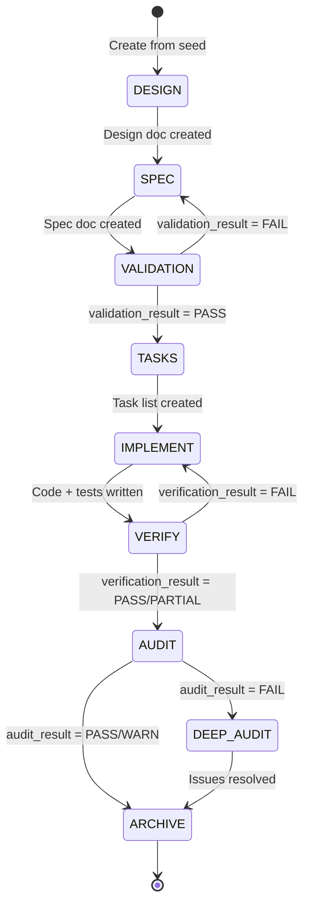

---

## 3) PRE-SDD Intake Flow

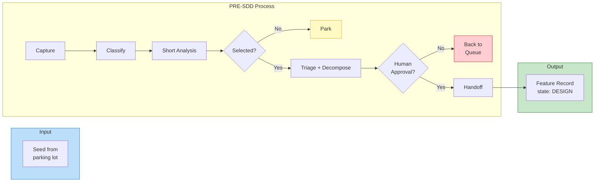

---

## 4) Rols i responsabilitats (no barrejar rols)

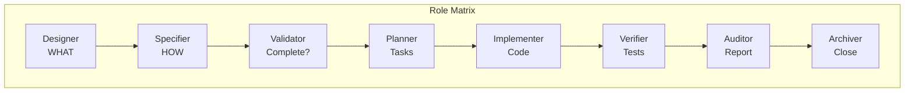

---

## 5) Gates i decision points

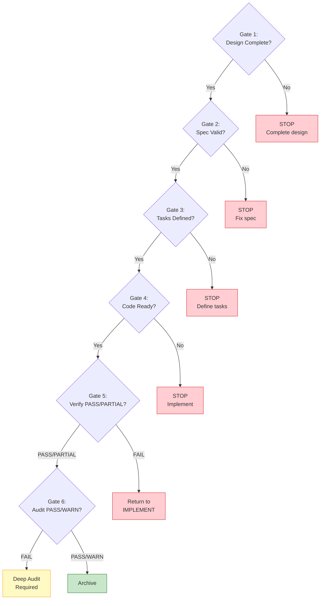

---

## 6) VERIFY/AUDIT Report Envelope (seccions obligatòries)

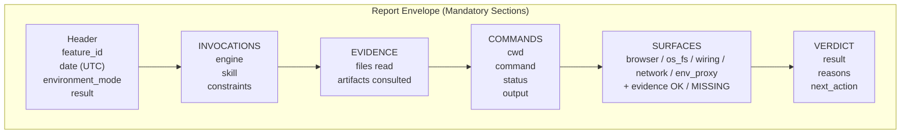

---

## 7) Integration Surfaces (Surface Gates)

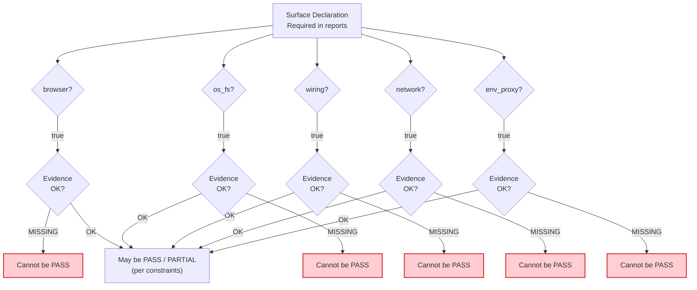

---

## 8) Artefactes SDD (carpetes)

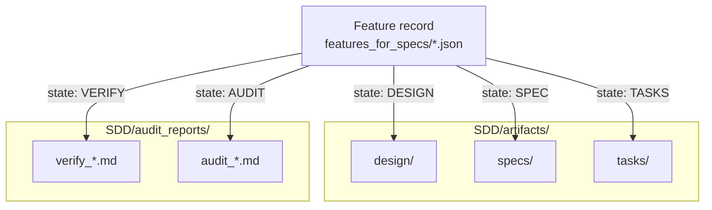

---

## 9) Verdict taxonomy (resum)

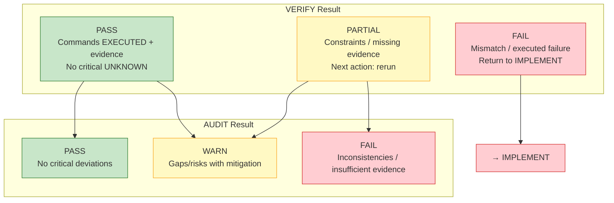

---

## 10) Context Engine (quan usar-lo)

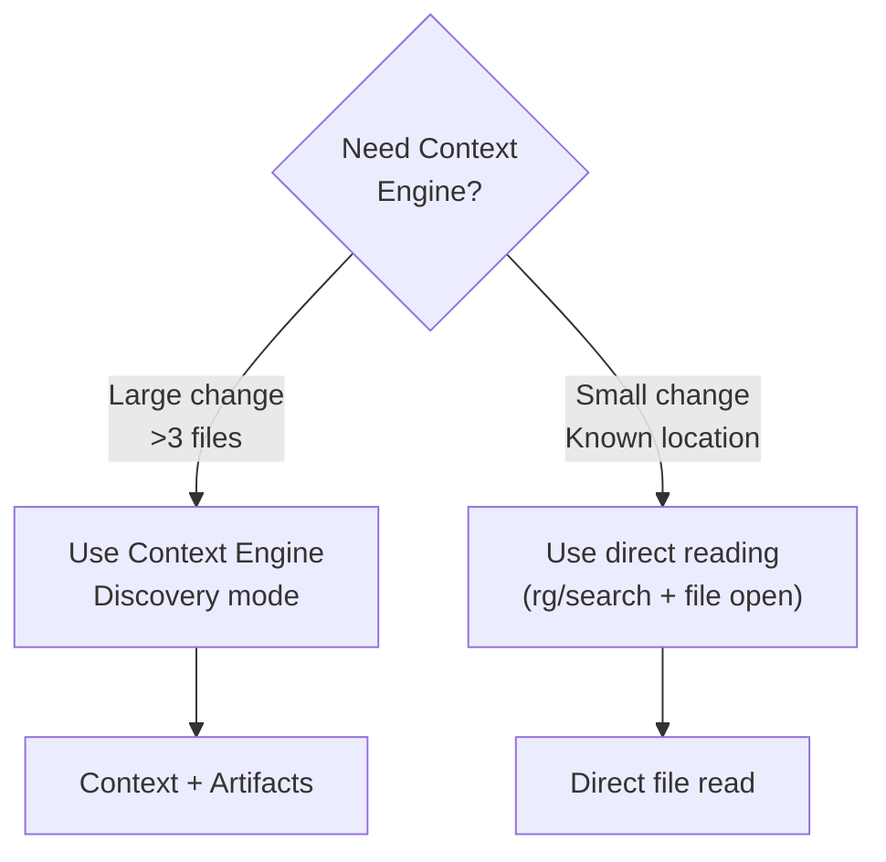

---

## 11) Change classification (Agent Decision Table)

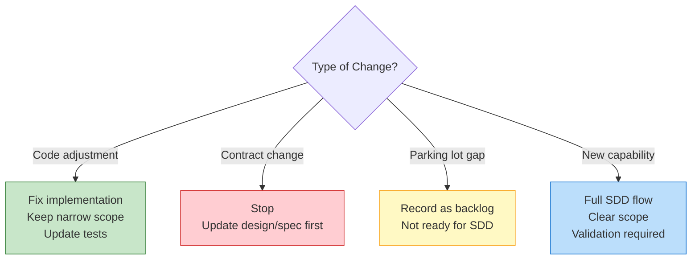

---

## 12) Chat execution modes (ADR 026)

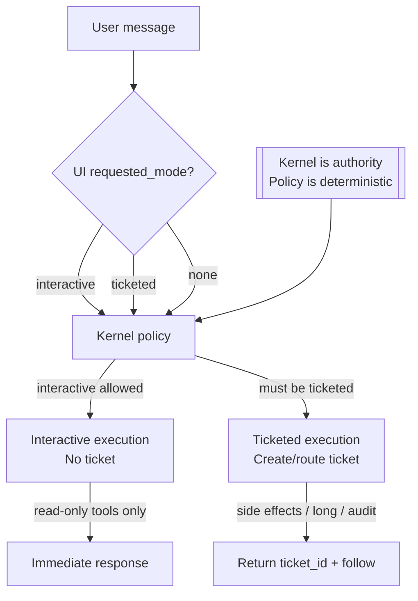

---

## 13) Ticket runtime mínim (ADR 024/025 + feat-019)

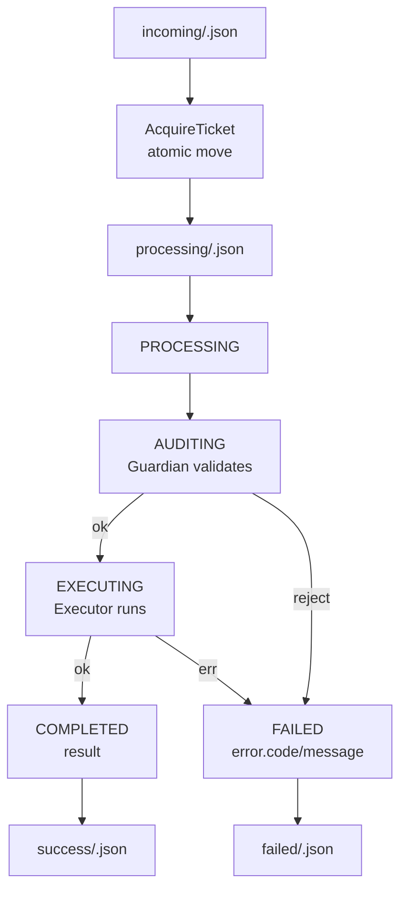

---

## Key takeaways

| Concepte | Regla |
|----------|-------|
| **No validated spec** | No implementation |
| **Validation gate** | `validation_result: PASS` abans de TASKS/IMPLEMENT |
| **Surface gates** | No `PASS` si `surface=true` i evidència MISSING |
| **Evidence-first** | Si no s’ha executat → `NOT EXECUTED` + reason |
| **Plan-only** | VERIFY no pot donar `PASS` |
| **Role separation** | No barrejar rols |
| **Kernel authority** | El Kernel decideix `interactive` vs `ticketed` (ADR 026) |

---

*Generated for human reference — `K:\AgenticOsGen\00_project_documentation`*

