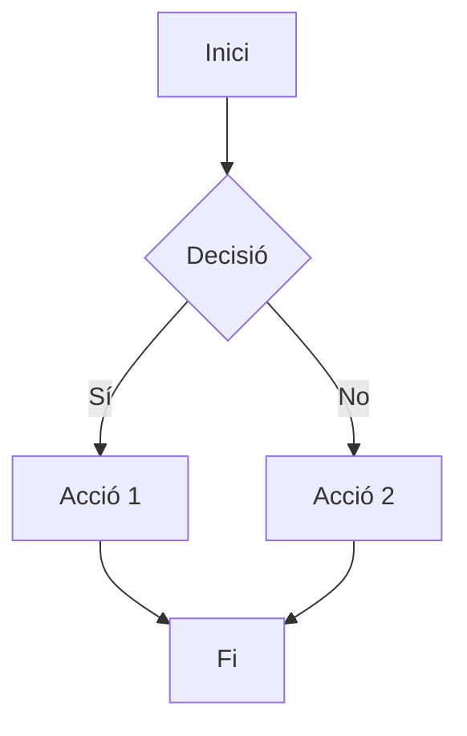

# Design: [Nom de la Feature]

## 1. Motivació

[Explica per què necessitem aquesta feature. Quin problema resol? Per què és important?]

## 2. Objectiu

[Definició clara i mesurable del que s'ha d'aconseguir. Ha de ser específic i verificable.]

**Exemple**: 
> Implementar un sistema de tickets que mogui fitxers JSON entre carpetes amb atomicitat garantida.

## 3. Components

Llista de components que s'han de crear o modificar:

| Component | Tipus | Descripció |
|-----------|-------|------------|
| [Nom] | [nou/modificat] | [Breu descripció] |

## 4. Flux Principal

### 4.1 Descripció textual

[Descriu pas a pas el comportament normal del sistema]

### 4.2 Diagrama (Mermaid)

## 5. Casos d'Ús

### Cas d'Ús 1: [Nom]
- **Actor**: [Qui fa l'acció]
- **Precondició**: [Què cal per començar]
- **Acció**: [Què fa]
- **Postcondició**: [Resultat esperat]

### Cas d'Ús 2: [Nom]
...

## 6. Hardware Budget

| Recurs | Valor | Justificació |
|--------|-------|--------------|
| **RAM** | X MB (peak) | [Per què necessita aquesta memòria] |
| **CPU** | X% en operació | [Què consumeix cicles] |
| **Disc** | X MB addicionals | [Què es guarda] |

**Target hardware**: Orange Pi 5B (16GB RAM)

## 7. Riscos i Limitacions

| Risc | Impacte | Mitigació |
|------|---------|-----------|
| [Risc 1] | [Alt/Mig/Baix] | [Com ho evitem] |

## 8. Preguntes Obertes [?]

[Llista aquí qualsevol dubte o decisió pendent. NO pots passar a SPEC si hi ha items aquí.]

- [ ] [Pregunta 1]
- [ ] [Pregunta 2]

## 9. Dependencies

[Altres features o components que cal tenir implementats abans.]

- Dependency 1
- Dependency 2

---

**Estat**: [DRAFT / REVIEW / COMPLETE]  
**Data**: [YYYY-MM-DD]  
**Autor**: [Nom]
