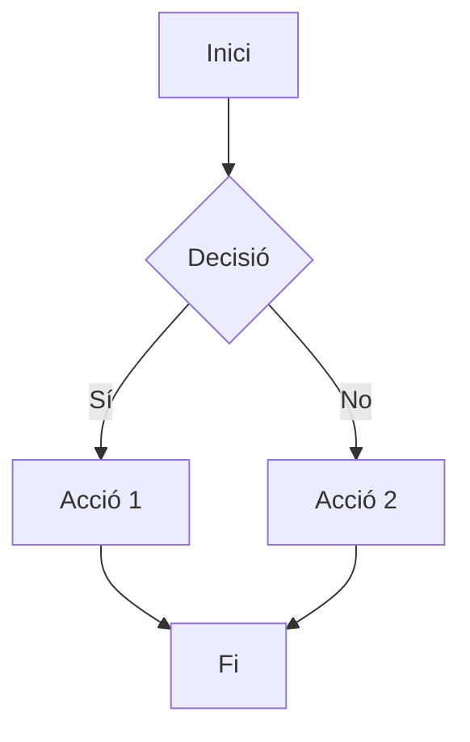

# Design: [Nom de la Feature]

## 1. Motivació

[Explica per què necessitem aquesta feature. Quin problema resol? Per què és important?]

## 2. Objectiu

[Definició clara i mesurable del que s'ha d'aconseguir. Ha de ser específic i verificable.]

**Exemple**:
> Implementar un sistema de validació que rebutgi paths perillosos abans de processar-los.

## 3. Components

Llista de components que s'han de crear o modificar:

| Component | Tipus | Descripció |
|-----------|-------|------------|
| [Nom] | [nou/modificat] | [Breu descripció] |

## 4. Flux Principal

### 4.1 Descripció textual

[Descriu pas a pas el comportament normal del sistema]

### 4.2 Diagrama (Mermaid)

## 5. Casos d'Ús

### Cas d'Ús 1: [Nom]
- **Actor**: [Qui fa l'acció]
- **Precondició**: [Què cal per començar]
- **Acció**: [Què fa]
- **Postcondició**: [Resultat esperat]

### Cas d'Ús 2: [Nom]
...

## 6. Hardware Budget (Opcional)

Omple aquesta secció només si el projecte té restriccions hardware definides a `sdd.config.json`.

| Recurs | Valor | Justificació |
|--------|-------|--------------|
| **RAM** | X MB (peak) | [Per què necessita aquesta memòria] |
| **CPU** | X% en operació | [Què consumeix cicles] |
| **Disc** | X MB addicionals | [Què es guarda] |

**Target hardware**: [Omplir si aplica, p. ex. "Raspberry Pi 4", "Servidor cloud t3.medium", "Embedded ARM"]

## 7. I/O Budget (Opcional)

Omple aquesta secció si la feature té operacions d'entrada/sortida significatives.

| Recurs | Valor | Justificació |
|--------|-------|--------------|
| **Disk reads** | X MB/s (peak) | [Què es llegeix i per què] |
| **Disk writes** | X MB/s (peak) | [Què escriu i quant sovint] |
| **Network inbound** | X MB/s (peak) | [Descàrregues, streaming, etc.] |
| **Network outbound** | X MB/s (peak) | [Pujades, API responses, etc.] |
| **File descriptors** | X (peak) | [Sockets, fitxers oberts simultàniament] |

## 8. Concurrency Model (Opcional)

Omple aquesta secció si la feature implica més d'un fil d'execució o procés.

| Aspecte | Decisió | Justificació |
|---------|---------|--------------|
| **Model** | [sequential / parallel / actor / CSP / async-await / thread-pool] | [Per què aquest model] |
| **Max workers** | X | [Límit de paral·lelisme] |
| **Shared state** | [sí/no] | [Què es comparteix i com es sincronitza] |
| **Race conditions** | [riscos identificats] | [Com s'eviten] |
| **Backpressure** | [sí/no] | [Com es gestiona la sobrecàrrega] |

## 9. Integration Surface (Obligatori)

Declara quines surfaces afecta aquesta feature (especifica `true`/`false` per a cada una):

| Surface | Aplica | Descripció |
|---------|--------|------------|
| **browser** | true/false | [UI web, CORS, cookies, storage] |
| **os_fs** | true/false | [Filesystem, paths, permisos, `ReadDir`, `os.Stat`] |
| **wiring** | true/false | [Handler → service/core, feature flags, routing, middleware] |
| **network** | true/false | [Outbound HTTP, retries, timeouts, provider health] |
| **env_proxy** | true/false | [Proxies, secrets, ports, local dev constraints] |

**Default:** Si no es declara cap surface, s'assumeix `wiring: true`.

## 10. Riscos i Limitacions

| Risc | Impacte | Mitigació |
|------|---------|-----------|
| [Risc 1] | [Alt/Mig/Baix] | [Com ho evitem] |

## 11. Preguntes Obertes [?]

[Llista aquí qualsevol dubte o decisió pendent. NO pots passar a SPEC si hi ha items aquí.]

- [ ] [Pregunta 1]
- [ ] [Pregunta 2]

## 12. Dependencies

[Altres features o components que cal tenir implementats abans.]

- Dependency 1
- Dependency 2

---

**Estat**: [DRAFT / REVIEW / COMPLETE]
**Data**: [YYYY-MM-DD]
**Autor**: [Nom]
