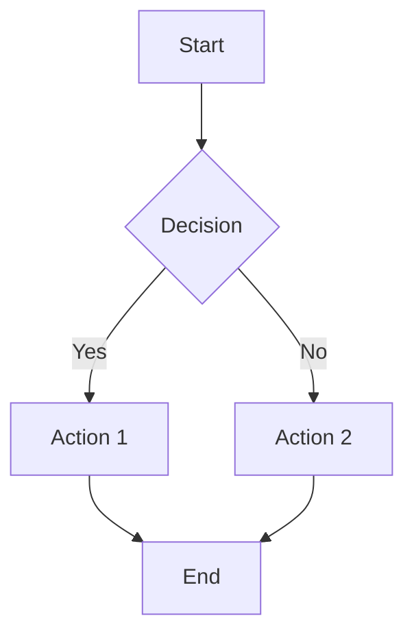

# Design: [Feature Name]

## 1. Motivation

[Explain why we need this feature. What problem does it solve? Why is it important?]

## 2. Objective

[Clear and measurable definition of what must be achieved. Must be specific and verifiable.]

**Example**:
> Implement a validation system that rejects dangerous paths before processing them.

## 3. Components

List of components to create or modify:

| Component | Type | Description |
|-----------|------|-------------|
| [Name] | [new/modified] | [Brief description] |

## 4. Main Flow

### 4.1 Textual description

[Describe step by step the normal system behavior]

### 4.2 Diagram (Mermaid)

## 5. Use Cases

### Use Case 1: [Name]
- **Actor**: [Who performs the action]
- **Precondition**: [What is needed to start]
- **Action**: [What they do]
- **Postcondition**: [Expected result]

### Use Case 2: [Name]
...

## 6. Hardware Budget (Optional)

Fill this section only if the project has hardware constraints defined in `sdd.config.json`.

| Resource | Value | Justification |
|----------|-------|---------------|
| **RAM** | X MB (peak) | [Why it needs this memory] |
| **CPU** | X% in operation | [What consumes cycles] |
| **Disk** | X MB additional | [What is stored] |

**Target hardware**: [Fill if applicable, e.g. "Raspberry Pi 4", "Cloud server t3.medium", "Embedded ARM"]

## 7. I/O Budget (Optional)

Fill this section if the feature has significant input/output operations.

| Resource | Value | Justification |
|----------|-------|---------------|
| **Disk reads** | X MB/s (peak) | [What is read and why] |
| **Disk writes** | X MB/s (peak) | [What writes and how often] |
| **Network inbound** | X MB/s (peak) | [Downloads, streaming, etc.] |
| **Network outbound** | X MB/s (peak) | [Uploads, API responses, etc.] |
| **File descriptors** | X (peak) | [Sockets, files open simultaneously] |

## 8. Concurrency Model (Optional)

Fill this section if the feature involves more than one execution thread or process.

| Aspect | Decision | Justification |
|--------|----------|---------------|
| **Model** | [sequential / parallel / actor / CSP / async-await / thread-pool] | [Why this model] |
| **Max workers** | X | [Parallelism limit] |
| **Shared state** | [yes/no] | [What is shared and how it is synchronized] |
| **Race conditions** | [identified risks] | [How they are avoided] |
| **Backpressure** | [yes/no] | [How overload is managed] |

## 9. Integration Surface (Mandatory)

Declare which surfaces this feature affects (specify `true`/`false` for each):

| Surface | Applies | Description |
|---------|---------|-------------|
| **browser** | true/false | [Web UI, CORS, cookies, storage] |
| **os_fs** | true/false | [Filesystem, paths, permissions, `ReadDir`, `os.Stat`] |
| **wiring** | true/false | [Handler → service/core, feature flags, routing, middleware] |
| **network** | true/false | [Outbound HTTP, retries, timeouts, provider health] |
| **env_proxy** | true/false | [Proxies, secrets, ports, local dev constraints] |

**Default:** If no surface is declared, `wiring: true` is assumed.

## 10. Risks and Limitations

| Risk | Impact | Mitigation |
|------|--------|------------|
| [Risk 1] | [High/Medium/Low] | [How we avoid it] |

## 11. Open Questions [?]

[List any doubt or pending decision here. You CANNOT pass to SPEC if there are items here.]

- [ ] [Question 1]
- [ ] [Question 2]

## 12. Dependencies

[Other features or components that must be implemented before.]

- Dependency 1
- Dependency 2

---

**Status**: [DRAFT / REVIEW / COMPLETE]
**Date**: [YYYY-MM-DD]
**Author**: [Name]
